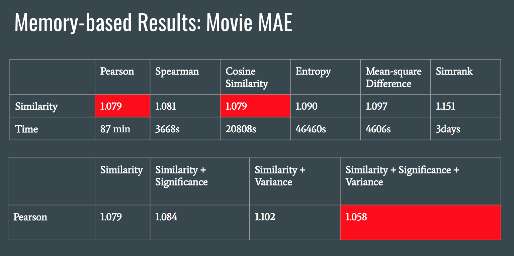
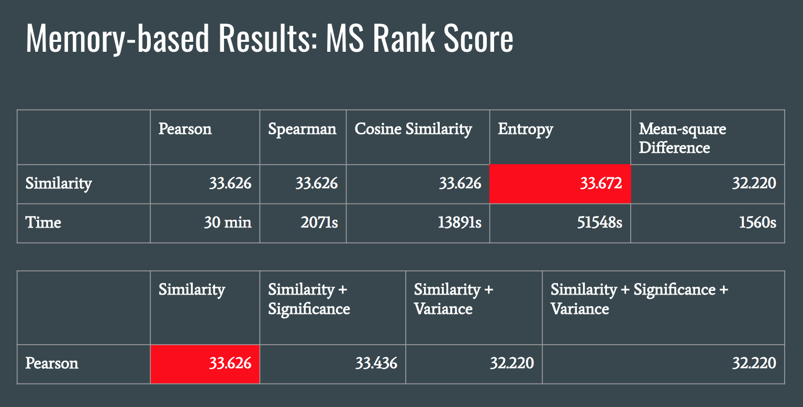

# Project 3- Collaborative Filtering Implementation and Evaluation

*This is a group project to which I contributed for Spring 2018 STAT 4243 Applied Data Science at Columbia University.*

----


### [Project Description](doc/)

Term: Spring 2018

+ Project title: Memory and model-based collaborative filtering
+ Team Number: 4
+ Team Members: Wanting Cheng, Kai Li, Joo Kim, Kenny Warner 
+ Project summary: 

For this project, we implemented and evaluated the performance of memory and model-based collaborative filtering algorithms on two datasets: Microsoft webpage data and movie data. Microsoft dataset contains a log of user visits to webpages, while movie data contains a list of movies that users have rated from 1 to 6.

### Memory-based Algorithm

#### Description

For the memory-based algorithm, the estimate of items to be recommended is largely based on how other users are rating these items. In particular, we calculate the similarity "score" between each pair of users using different methodologies (pearson correlation, spearman correlation, cosine similarity, entropy, squared difference, simrank) and estimate how the active user would rate a given item based on other similar user's ratings on the given item. Having computed the similarity weights, we incorporated **significance weight** (Idea: devalue users with few commonly rated items) and **variance weight** (Idea: devalue items with low variance).

#### Results 

We evaluated the performance of our memory-based algorithm using **Mean Absolute Error (MAE)** and **Ranked Scoring** metrics. MAE calculates how far our predictions deviate from the outcome and is used on the movie dataset. Ranked scoring is applied on MS dataset and uses a utility function to evaluate how satisfied the user will be if she sees our ranked list of recommended items, based on the real outcome. Ranking score was used to evalute the movie dataset. Below are the results. 





### Model-based Algorithm

#### Description

Model-based collaborative filtering involves developing and optimizing models to fit the data and then use the said models to make the predictions without having to rely on the entire dataset every time it is asked to make a prediction for a new user. Thus, it is more computationally efficient than the memory-based method. For this project, we used the Expectation-Maximization (EM) algorithm, an iterative method for finding the maximum likelihood estimates of parameters, in order to cluster the users into five gruops based on "latent" variables that inform their common movie rating history. Once the user user clusters are optimized, their votes on the movies are considered independent. 

#### Results 

We ran the EM algorithm on the whole movie and MS datasets; however, due to time constraints, we only ran 10 iterations and extracted the parameters: gamma array (a 3-dimensional array with probabilities of giving a certain movie a certain score if a user belongs to a certain cluster) and assignment matrix (a matrix with users in rows and clusters in columns and probabilities of belonging to that cluster). Given additional time, we would have evaluated the model's performance using MAE and Ranked Scoring to compare against the memory-based algorithm. Computing running time would have allowed us to confirm one of the biggest advantages of the model-based algorithm, computational efficiency. 

### Contribution statement: 

+ Wanting Cheng: Memory-Based: entropy, mean-square-difference, simrank, impliemtation and prediction, compiled main.R and function.R, coded evaluation metrics for both ranked scoring and MAE, EM Algorithm. 
+ Kai Li: EM Algorithm, Memory-Based:spearman, consine similiarty, significant weighting, variance weighting, impliemtation and prediction.
+ Joo Kim: Model-Based: coded E and M-step functions, created and contributed to readme and PPT presentation. 
+ Kenny Warner: Helped code E step and created prediction functions and prediction matrices. 

Following [suggestions](http://nicercode.github.io/blog/2013-04-05-projects/) by [RICH FITZJOHN](http://nicercode.github.io/about/#Team) (@richfitz). This folder is orgarnized as follows.

```
proj/
├── lib/
├── data/
├── doc/
├── figs/
└── output/
```

Please see each subfolder for a README file.
